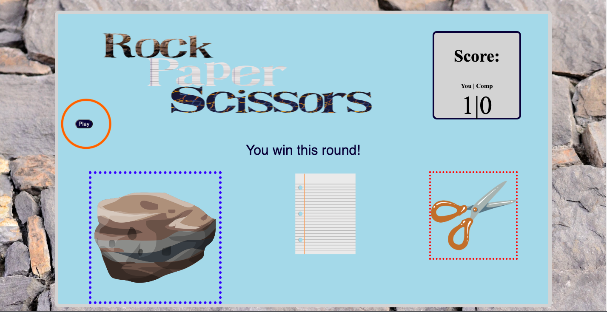
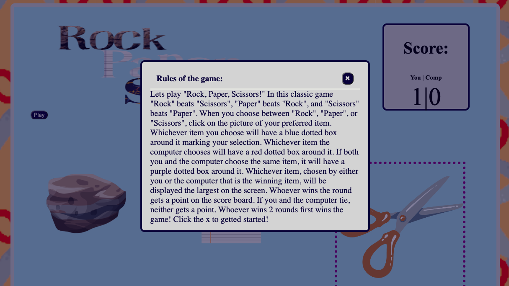
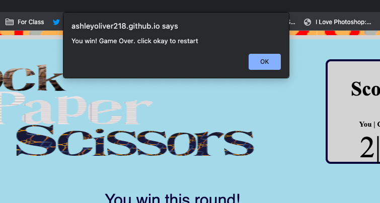

# <ins>Rps- Rock Paper Scissors</ins> 
&nbsp;
This project was a simple game I created with a design that I wanted to be simple and self explanatory. I wanted for a child to be able to figure out
what is going on during the game and inherently understand how to play it. The game is a very classic and simple game so I wanted mimic
those sentiments in my design. I added small surprise elements that created pops of color and movement to enhance the simple design aesthetics.
&ensp;

# <ins>Motivation</ins>
&nbsp;
I created this game for a class project at Per Scholas. I knew this game would help me not only put together all of the puzzle pieces of what we had learned so far into a bigger picture, but it would also help me learn a lot along the way.
&ensp;
​

# <ins>Build Status</ins>
&nbsp;
This game build is complete for the computer version.
UP-COMING FEATURES: Mobile compatible design.
&ensp;
​

# <ins>Tech used</ins>
&nbsp;
I used Visual Studio Code to Create an Html, Javascript, CSS, and README file.
&nbsp;
I used Youtube for inspiration:

[Build a Popup With JavaScript](https://www.youtube.com/watch?v=MBaw_6cPmAw)

[3 ways to code Rock Paper Scissors in JavaScript (Beginner to Intermediate to Advanced!)](https://www.youtube.com/watch?v=RwFeg0cEZvQ)

[Web Development Tutorial - JavaScript, HTML, CSS - Rock Paper Scissors Game](https://youtu.be/jaVNP3nIAv0)

[How To Code Rock Paper Scissors In JavaScript](https://youtu.be/1yS-JV4fWqY)
​
[Learn JavaScript Event Listeners In 18 Minutes](https://youtu.be/XF1_MlZ5l6M)

I used Canva to create my title, my Rock Paper and Scissors buttons, and my rock paper and scissors backgrounds
&ensp;
​

# <ins>How to play:</ins>
&nbsp;
There is no need for any installation to play this game! All you need to do is go to Link:[rps](https://ashleyoliver218.github.io/rps/)

Then you hit play!

In the play button there are also the rules and basic instructions of the game!

When you receive a game over message click ok to restart the game.

​

# <ins>Possible Changes?</ins>
&nbsp;
If I could change anything about my game I would add a sleek mode that completely restyles the page and gives it a more sleek design.

I would also like to add mobile compatibility.
&ensp;
​

# <ins>Credits</ins>
&nbsp;
[Web Dev Simplified](https://www.youtube.com/@WebDevSimplified)
I watched several videos for research (listed above) and each video gave me an idea of something to add to my game!

I also want to thank Jenna, Yonas, Amari, and Kasper for help on the small details of my code's functionality. Your help was greatly appreciated!

​

​